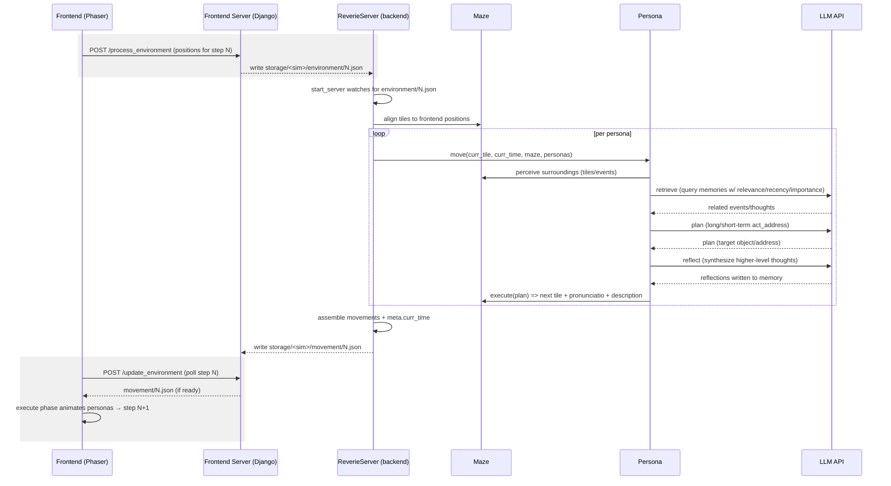

# Step Flow Sequence

Live simulation loop for one step, including LLM calls and key modules.

```mermaid
sequenceDiagram
    participant Browser as Frontend (Phaser)
    participant Django as Frontend Server (Django)
    participant RS as ReverieServer (backend)
    participant Maze as Maze
    participant Persona as Persona
    participant LLM as LLM API

    rect rgb(240,240,240)
    Browser->>Django: POST /process_environment (positions for step N)
    Django-->>RS: write storage/<sim>/environment/N.json
    end

    RS->>RS: start_server watches for environment/N.json
    RS->>Maze: align tiles to frontend positions

    loop per persona
      RS->>Persona: move(curr_tile, curr_time, maze, personas)
      Persona->>Maze: perceive surroundings (tiles/events)
      Persona->>LLM: retrieve (query memories w/ relevance/recency/importance)
      LLM-->>Persona: related events/thoughts
      Persona->>LLM: plan (long/short-term act_address)
      LLM-->>Persona: plan (target object/address)
      Persona->>LLM: reflect (synthesize higher-level thoughts)
      LLM-->>Persona: reflections written to memory
      Persona->>Maze: execute(plan) => next tile + pronunciatio + description
    end

    RS->>RS: assemble movements + meta.curr_time
    RS-->>Django: write storage/<sim>/movement/N.json

    rect rgb(240,240,240)
    Browser->>Django: POST /update_environment (poll step N)
    Django-->>Browser: movement/N.json (if ready)
    Browser->>Browser: execute phase animates personas → step N+1
    end
```
